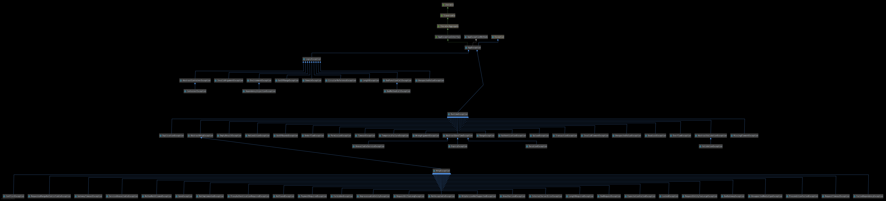

# php-app-exception

[](https://travis-ci.org/seikouhou/php-app-exception)
[](https://codecov.io/gh/seikouhou/php-app-exception)
[](https://packagist.org/packages/seikouhou/php-app-exception)
[](LICENSE)

This repository is PHP exception extended for application

## Overview

phpで例外主体のﾌﾟﾛｸﾞﾗﾐﾝｸﾞを容易にする為の例外ｾｯﾄです。

## Description

当例外ｾｯﾄは、ﾒｿｯﾄﾞ、関数が非正常系処理結果を全て例外で返すことを容易にする為のものです。

ここでいう非正常系処理結果とは正常な処理結果以外全ての事を指します。つまり、会員名簿を読み出す関数などの場合は、会員名簿を読み出すことができた場合のみが正常処理で、その他の場合(認証ｴﾗｰが発生した、DBに障害が発生した、会員名簿が未登録だったなども)は全て非正常系の処理結果となります。

一般的な方法では、進行不能な致命的なｴﾗｰ発生時のみ例外を投げ、その他のｴﾗｰ通知は戻り値で偽を返すなどと言った方法でしたが、今回推奨する方法は、当例外ｾｯﾄを使用し、非正常系の処理結果については全て例外で返すという方法です。

このやり方のﾒﾘｯﾄとして下記のようなものがあげられます。

* ﾛｼﾞｯｸの見通しが良くなる

    全ての非正常処理はcatch節で処理する事になるので、正常処理を扱うﾒｲﾝﾛｼﾞｯｸとの分離がより明確となり、ﾛｼﾞｯｸの見通しが向上します。

* ｴﾗｰの表現力が上がる

    ｴﾗｰが例外で渡されるということは、\Exceptionｸﾗｽが持つ、getMessageﾒｿｯﾄﾞ、getCodeﾒｿｯﾄﾞ、getFileﾒｿｯﾄﾞ、getLineﾒｿｯﾄﾞ、getTraceﾒｿｯﾄﾞ等使える事になるので、例外発生時の状況がより詳細に取得でき、ﾃﾞﾊﾞｯｸﾞ時の助けになります。
    また、当例外ｾｯﾄに同梱されているphpｴｸｽﾃﾝｼｮﾝを導入する事により、例外発生時のﾛｰｶﾙｽｺｰﾌﾟの変数のｽﾅｯﾌﾟｼｮｯﾄ(ｸﾞﾛｰﾊﾞﾙｽｺｰﾌﾟのｽﾅｯﾌﾟｼｮｯﾄはphpｴｸｽﾃﾝｼｮﾝ無しでもOK)を取得する事も可能です。

* ｴﾗｰの見逃しが少なくなる

    戻り値ﾍﾞｰｽでのｴﾗｰ通知は、当然ながら戻り値を受け取ってｴﾗｰであるかどうか判定しなければなりません。
    これはﾒｿｯﾄﾞ、関数の呼び出し回数が増えれば増えるほどｺｰﾄﾞのｺｽﾄとなって跳ね返ってきます。
    例外ﾍﾞｰｽのｴﾗｰ通知であればcatch節でまとめて処理できるｹｰｽも増え、ｺｰﾄﾞの効率化になります。
    また、戻り値のﾁｪｯｸは書き手によっては見逃されがちでもあり、例外の通知に関しては、意図的に無視しない限り見逃すことは出来ませんので、ｴﾗｰの発見に関しては優位になります。

当例外ｾｯﾄは、上記方法を容易にする為の各種機能を備えています。

## Requirement

* composer
* php5.6+ (php7は未検証)
* ext-mbstring
* ext-json (phpの標準で組み込まれているはず)
* ext-dom (ｿｰｽの修正を行い、単体ﾃｽﾄをしたい場合のみ必要)
* ext-xsl (ｿｰｽの修正を行い、ﾄﾞｷｭﾒﾝﾄの更新をしたい場合のみ必要)

## Installation

php-app-exceptionはPackagistから利用可能です。

composerを経由した導入を推奨いたします。

`composerでの導入`
```
# cd /path/to/project ← php-app-exceptionを導入したいﾌﾟﾛｼﾞｪｸﾄのﾌｫﾙﾀﾞへ移動
# composer init -q ← まだcomposerが導入されていないのなら
# composer require seikouhou/php-app-exception
```

また、例外発生時のﾛｰｶﾙｽｺｰﾌﾟの変数のｽﾅｯﾌﾟｼｮｯﾄを取得したい場合は、付属のphpｴｸｽﾃﾝｼｮﾝを導入して下さい。

`CentOS7.6での導入例`
```
# sudo yum -y --enablerepo=remi,remi-php56 install php-devel gcc ← remiの導入が必要
# cd /path/to/project/vendor/seikouhou/php-app-exception/src/extension
# phpize
# ./configure
# make
# sudo make install
# cat << EOD | sudo tee /etc/php.d/99-app_exception.ini > /dev/null
> ; Enable app_exception extension module
> extension=app_exception.so
> EOD
# php -m | grep '_AppException'
_AppException ← これが表示されればOK
```

実際に利用するには、phpのｽｸﾘﾌﾟﾄ中でcomposerのｵｰﾄﾛｰﾀﾞｰを読み込んでご利用下さい。

```
<?php
// composerのｵｰﾄﾛｰﾀﾞｰ読み込み
require_once('/path/to/project/vendor/autoload.php');
```

## Class Hierarchy Diagram

[](https://seikouhou.github.io/php-app-exception/images/class_diagram.png)

上図が当例外ｾｯﾄのｸﾗｽ階層図となっています。

大別して以下の3つに別れています。

* ﾛｼﾞｯｸ例外(SKJ\AppException\LogicException)
    
    SPLで標準的に用意されているLogicExceptionに対応したもので、この例外、もしくはこの例外を継承した例外が発生した場合は、ｺｰﾄﾞのﾊﾞｸﾞや環境の不備などが考えられます。すなわち、通常では発生しないはずの例外という意味になります。
    
* ﾗﾝﾀｲﾑ例外(SKJ\AppException\RuntimeException)

    SPLで標準的に用意されているRuntimeExceptionに対応したもので、この例外、もしくはこの例外を継承した例外が発生は、LogicException系とは違いﾊﾞｸﾞや環境の不備などを意味せず、実行時に起こりうるものです。
    つまり、ﾌﾟﾛｸﾞﾗﾑ実行時の外部からの入力等に起因し、状況によっては必然として発生する例外となりますので、catchした側で何らかの対応をしなければならない可能性があります。
    
* HTTP例外(SKJ\AppException\Runtime\HttpException)

    この例外を直接使用する事はなく、基本的にはこの例外を継承した例外を使用します。   
    400以上のHTTPｽﾃｰﾀｽｺｰﾄﾞに対応した例外が用意されているので、APIなどでHTTPｽﾃｰﾀｽｴﾗｰなどを出したい場合にこの例外を投げます。(例としては404を出力したい場合にはSKJ\AppException\HTTP\NotFoundExceptionを投げる)
    また、この例外はいくつかの情報(HTTPｽﾃｰﾀｽｺｰﾄﾞ、HTTPﾍｯﾀﾞ、HTTPｸｯｷｰ、ﾚｽﾎﾟﾝｽﾎﾞﾃﾞｨに表示すべき情報など)を保持、取得するﾒｿｯﾄﾞなど持っています。
    これらの情報はgetterﾒｿｯﾄﾞで取得できますので、ｴﾗｰ画面やﾚｽﾎﾟﾝｽﾎﾞﾃﾞｨの表示の際に利用して下さい。

当例外ｾｯﾄではSPLで用意されている例外は、全て対応する例外を用意しています。それにﾌﾟﾗｽして上記のHTTP系例外といくつかの独自例外を追加しています。

詳しくはﾘﾎﾟｼﾞﾄﾘの[docsﾌｫﾙﾀﾞ配下にあるAPIﾄﾞｷｭﾒﾝﾄ](https://seikouhou.github.io/php-app-exception/apigen/)を参照して下さい。

## How to Customize

標準で用意している例外はあくまでもｻﾝﾌﾟﾙで、\SKJ\AppExceptionといくつかの固有例外(SPL例外に対応させた例外、HTTP系例外、\SKJ\AppException\LogicException、\SKJ\AppException\RuntimeException、\SKJ\AppException\ContainerException)意外は利用者側で自由に変更可能です。

ただし、追加、変更、削除できるのは名前空間、\SKJ\AppException\Logicと\SKJ\AppException\Runtimeに属する例外だけで、基本的には\SKJ\AppException\LogicExceptionもしくは\SKJ\AppException\RuntimeExceptionを継承した例外となります。

修正方法は./binﾌｫﾙﾀﾞ配下にある、logic.php、runtime.phpを修正するだけです。

上記ﾌｧｲﾙに配列で生成する例外が定義してありますので、ﾌｫｰﾏｯﾄにそって自由に追加、修正、削除をおこなって下さい。

また、作成した例外にﾌﾟﾛﾊﾟﾃｨやﾒｿｯﾄﾞを追加したい場合は、./src/exceptionﾌｫﾙﾀﾞ配下に抽象ｸﾗｽを作成してもらい、それを継承する形でおこなって下さい。

必要な修正が完了したら以下の方法で例外を更新して下さい。

`例外の更新方法`
```
# cd /path/to/project/vendor/seikouhou/php-app-exception/
# composer expgen ← 例外の更新
# composer install ← docs配下のﾄﾞｷｭﾒﾝﾄも更新したい場合は以下を実行
# composer apigen 
```

## How to Use

当例外の典型的な利用例として、ある店舗の商品在庫情報を読み込む処理で説明していきます。

### 商品在庫管理ﾌﾟﾛｸﾞﾗﾑ

`stock.php`

[](https://seikouhou.github.io/php-app-exception/scripts/source001.txt)

`stock.csv`
```
1,12
2,20
5,49
```
`実行結果`
```
# php stock.php
商品コードが1の在庫数は12個です
商品コードが2の在庫数は20個です
商品コードが5の在庫数は49個です
```
stock.csvに記録されている在庫情報を読み込み、一覧として在庫数を表示するﾌﾟﾛｸﾞﾗﾑです。

\SKJ\AppExceptionから始まる例外が拡張された例外で、ここでは発生した非正常系の処理結果に大まかな意味を持たせる意味で例外のｸﾗｽを使い分けています。つまり、ﾒｿｯﾄﾞの呼び出し側はｷｬｯﾁした例外のｸﾗｽで非正常系の処理結果がどんな内容かを判断しています。

その後しばらくして、ﾌﾟﾛｼﾞｪｸﾄの別のﾒﾝﾊﾞｰがShopｸﾗｽに商品ｺｰﾄﾞから商品名を返すgetItemNameﾒｿｯﾄﾞを追加してくれたとします。折角ですので、readStockﾒｿｯﾄﾞも商品名を返すように修正していきます。

`stock.php`

[](https://seikouhou.github.io/php-app-exception/scripts/source002.txt)

`items.csv`
```
1,りんご
2,バナナ
3,いちご
4,マンゴー
5,みかん
```
`実行結果`
```
# php stock.php
りんごの在庫数は12個です
バナナの在庫数は20個です
みかんの在庫数は49個です
```
商品ｺｰﾄﾞの代わりに商品名が表示され、よりわかりやすくなりました。

### 発生する例外の固定化をする

前述のﾌﾟﾛｸﾞﾗﾑには問題があります。readStockﾒｿｯﾄﾞからgetItemNameﾒｿｯﾄﾞを呼んでいるのですが、getItemNameﾒｿｯﾄﾞが例外を投げる事を考慮していません。

getItemNameﾒｿｯﾄﾞが投げる例外は

1. \SKJ\AppException\Logic\EnvironmentException
    * 商品管理ﾌｧｲﾙが開けない場合に投げられる
2. \SKJ\AppException\Runtime\OutOfBoundsException
    * 商品ｺｰﾄﾞに該当する商品が無い場合に投げられる
3. \SKJ\AppException\Logic\UnexpectedValueException
    * その他回復不能な異常が発生した場合(ここではﾌｧｲﾙのｸﾛｰｽﾞ失敗)に投げられる

以上3つになります。

特に2のOutOfBoundsExceptionに関しては、最上位でｷｬｯﾁすらされていないので、phpのfatalｴﾗｰになってしまいます。できればdieで終わったほうが統一されてより良いでしょう。

また、3はともかく、1に関しては原因が商品管理ﾌｧｲﾙが開けない事に起因しているにもかかわらず、ｴﾗｰﾒｯｾｰｼﾞは「在庫管理ﾌｧｲﾙに問題があります」といった間違った表示がされてしまいます。

そこで、readStockﾒｿｯﾄﾞを下記のように修正します。

`修正されたreadStockﾒｿｯﾄﾞ`

[](https://seikouhou.github.io/php-app-exception/scripts/source003.txt)

変更された点は元のｺｰﾄﾞ(26行目～54行目)をtry、catchﾌﾞﾛｯｸで囲んでいる部分です。
catchﾌﾞﾛｯｸでは受け取った例外を\SKJ\AppException\Logic\ContainerExceptionｸﾗｽのｺﾝｽﾄﾗｸﾀの第3引数に渡して(例外の連結)、throw(58行目～60行目)しています。

ただ、普通に考えればこれは間違ったﾛｼﾞｯｸです。
なぜならば、このﾛｼﾞｯｸだとtry～catch間の**ｺﾝﾃｷｽﾄ**(26行目～54行目)の間で投げられる例外は、結局の所全て、\SKJ\AppException\Logic\ContainerExceptionｸﾗｽの例外になって外へと出るからです。

しかし、この\SKJ\AppException\Logic\ContainerExceptionｸﾗｽの例外は他の例外と違う特徴があります。 
それは第3引数に渡した値がtry～catch間の**ｺﾝﾃｷｽﾄ**(26行目～54行目)で**newされた例外**であれば\SKJ\AppException\Logic\ContainerExceptionｸﾗｽのｺﾝｽﾄﾗｸﾀの処理を中断し、第3引数に渡された例外をそのまま再度投げ直すようになっているところです。

これが何を意味するかというと、try～catch間の**ｺﾝﾃｷｽﾄ**(26行目～54行目)でnewされた例外は全てそのまま加工されずに外へと出ていき、try～catch間の**ｺﾝﾃｷｽﾄ**(26行目～54行目)**以外**で**newされた例外**は全て\SKJ\AppException\Logic\ContainerExceptionｸﾗｽの例外になって外へと出ていくという事です。

このｹｰｽでいうとgetItemNameﾒｿｯﾄﾞ自体は、try～catch間の**ｺﾝﾃｷｽﾄ**(26行目～54行目)から呼ばれているものですが、例外の生成(new)ｺｰﾄﾞ自体はgetItemNameﾒｿｯﾄﾞの中で行われているので、try～catch間の**ｺﾝﾃｷｽﾄ外**(26行目～54行目)として扱われ、\SKJ\AppException\Logic\ContainerExceptionｸﾗｽの例外に連結され外へと出ていきます。

これでひとまず、getItemNameﾒｿｯﾄﾞがどんな例外を投げても、\SKJ\AppException\Logic\ContainerExceptionｸﾗｽの例外になって出ていくので、readStockﾒｿｯﾄﾞの投げる例外に変化は起こらない(固定化)という事になり、最上位のｺﾝﾃｷｽﾄで想定外の例外が返ってくる事による誤動作は避けられます。

本来理想を言えば、getItemNameﾒｿｯﾄﾞのphpdocに変更があった時点で、getItemNameﾒｿｯﾄﾞを呼び出しているｺｰﾄﾞ部分はその影響を検証するべきです。

ただ、多人数で開発していると引数の変更はともかくとして、発生する例外の変更の周知は非検査例外言語であるphpでは難しいものがあるかと思います。
特にgetItemNameﾒｿｯﾄﾞの中で別のﾒｿｯﾄﾞを呼び出しており、そのﾒｿｯﾄﾞが新たに認知していない例外を発生させたりするとより難しくなりますし、利用するﾌﾚｰﾑﾜｰｸ、ﾗｲﾌﾞｲﾗﾘなどによっては発生する例外が明示されていないｹｰｽもあります

そこで、ﾒｿｯﾄﾞ、関数を作る際には、その中で発生した例外以外は一旦、\SKJ\AppException\Logic\ContainerExceptionｸﾗｽの例外に連結して、**「未知、未分類の例外」という抽象化**をおこなって外に出すという処理を行う必要があるのです。

こうする事により、あるﾒｿｯﾄﾞを利用する際、そのﾒｿｯﾄﾞがｺｰﾄﾞ中で他のどんなﾒｿｯﾄﾞを呼び出していても、それらのﾒｿｯﾄﾞが返す例外を気にする必要はなくなります。
利用者は自分が呼び出すﾒｿｯﾄﾞのphpdocのみだけ把握すればよくなります。

ただし、最上位のｺﾝﾃｷｽﾄなどで\SKJ\AppException\Logic\ContainerExceptionｸﾗｽの例外を受け取った場合は、その梱包を紐解き(方法は後述)、どのような場所でどのような非正常系処理結果が発生したのか確認して、必要であれば該当するﾒｿｯﾄﾞの処理の変更や、それに伴うphpdocの更新を検討(\SKJ\AppException\Logic\ContainerExceptionに連結させずに、独立した例外とする)はすべきでしょう。

### 発生する例外を最適化する

getItemNameﾒｿｯﾄﾞに関して言えば、getItemNameﾒｿｯﾄﾞが発生させる例外全てを\SKJ\AppException\Logic\ContainerExceptionｸﾗｽの例外に連結して投げるのは少々乱暴でもあるかと思います。
本来的には、自分の管轄外の例外に対して「未知・未分類の例外」であるというﾏｰｷﾝｸﾞをしているにすぎないので、自分の管轄外の例外に対してもｺｰﾃﾞｨﾝｸﾞ時点で発生がはっきりとしているものに関しては何らかの基準をもって処理方針を定めるべきです。

発生する例外をどのように処理するか？に関しては以下のﾊﾟﾀｰﾝが考えられます。

1. 基本的には発生しない例外
2. 発生しても呼び出し側では何の対処もできない例外
3. 発生したら何らかの処理をすべき例外
4. 発生したらphpdocを更新し、自らが発するものとして扱わなければならない例外

1に関しては、getItemNameﾒｿｯﾄﾞにはないのですが、例えば引数に数値以外を渡すとｴﾗｰとして例外を返すようなﾒｿｯﾄﾞの場合、引数に渡す数値がﾊｰﾄﾞｺｰﾃﾞｨﾝｸﾞしてあれば数値以外が引数に渡される事はなく、絶対にｴﾗｰが発生しないのでこういったｹｰｽにあたります。
基本的には発生しない例外なのですが、いちおうﾌﾟﾛｸﾞﾗﾑ的には\SKJ\AppException\Logic\ContainerExceptionｸﾗｽの例外に連結して投げるようにすべきです。

2に関しては、getItemNameﾒｿｯﾄﾞでﾌｧｲﾙのｸﾛｰｽﾞに失敗した場合に投げられる、\SKJ\AppException\Logic\UnexpectedValueExceptionがそれにあたります。
基本ﾌｧｲﾙｸﾛｰｽﾞで失敗する事はほぼないのですが、もし発生したとしても呼び出し側のﾛｼﾞｯｸで復帰処理などをする事も出来ないかと思われますので、これも基本的には\SKJ\AppException\Logic\ContainerExceptionｸﾗｽの例外に連結して投げるか、それともreadStockﾒｿｯﾄﾞに元からある\SKJ\AppException\Logic\UnexpectedValueExceptionと統合して返すか検討すべきです。

3に関しても、getItemNameﾒｿｯﾄﾞにはないのですが、例えばﾒｿｯﾄﾞの中でﾘﾓｰﾄ通信などを行っており、それに失敗した場合に投げられるような例外であれば該当します。
なぜなら、呼び出し元がその例外を受け取った場合には、何秒か待った上でﾘﾄﾗｲ処理などを行う可能性があるからです。
上記ｹｰｽであれば、ﾘﾄﾗｲに成功すれば例外の発生は必要無いですし、最大ﾘﾄﾗｲ回数を超えるようであれば、新たに何らかの例外(\SKJ\AppException\Runtime\TimeoutExceptionなど)を投げる必要があるでしょう。

4に関しては、商品管理ﾌｧｲﾙが見つからない場合に投げられる\SKJ\AppException\Logic\EnvironmentException、商品ｺｰﾄﾞが存在しない場合に投げられる\SKJ\AppException\Runtime\OutOfBoundsExceptionが該当します。
この2つに関してreadStockﾒｿｯﾄﾞが自分のものとして発生させるかどうかは設計の考え方によるかと思いますが、今回は発生させるようにします。

readStockﾒｿｯﾄﾞを上記をふまえて修正します。

`修正されたreadStockﾒｿｯﾄﾞ`

[](https://seikouhou.github.io/php-app-exception/scripts/source004.txt)

修正箇所は35～56行目で、getItemNameﾒｿｯﾄﾞから投げられる\SKJ\AppException\Logic\EnvironmentExceptionと\SKJ\AppException\Runtime\OutOfBoundsExceptionをｷｬｯﾁしています。

注意事項として、受け取った例外をそのまま投げないで、受け取った例外と同じｸﾗｽで新たにnewしなおして、受け取った例外はそれに連結する形で投げて下さい。
そうしないと、readStockﾒｿｯﾄﾞで発生した例外とみなされない為、\SKJ\AppException\Logic\ContainerExceptionｸﾗｽの例外に連結されてしまいます。

### 同一ｸﾗｽの例外を区別する

気づいた方もいるかもしれませんが、phpdocの\SKJ\AppException\Logic\EnvironmentExceptionに関しての説明文が「**在庫**管理ﾌｧｲﾙが開けない」から「管理ﾌｧｲﾙが開けない」へと変更されています。

これはgetItemNameﾒｿｯﾄﾞの返す\SKJ\AppException\Logic\EnvironmentExceptionが「**商品**管理ﾌｧｲﾙが開けない」という意味なので、両者の間をとって「管理ﾌｧｲﾙが開けない」という説明文に変更しています。

今回に関してはこのままでも良いかと思いますが、同一ｸﾗｽの例外であっても明確に区別したいｹｰｽもあるかと思います。

そこで、例外のｺﾝｽﾄﾗｸﾀの第2引数で指定される例外ｺｰﾄﾞを使用して区別していきます。

`修正されたstock.php`

[](https://seikouhou.github.io/php-app-exception/scripts/source005.txt)

変更箇所としては、例外ｺｰﾄﾞとして使用する数値をｸﾗｽ定数として10～13行目、73～78行目に定義し、例外生成時にそのｸﾗｽ定数を例外のｺﾝｽﾄﾗｸﾀの第2引数に指定しています。

また、それに伴いphpdocにも@usesとして、各ﾒｿｯﾄﾞに例外ｺｰﾄﾞとして使用しているｸﾗｽ定数を追加し、@throwsの説明文末尾にも、その例外ｸﾗｽが保有する可能性のある例外ｺｰﾄﾞをｸﾗｽ定数名の末尾の数値で追加しています。
つまりそのﾒｿｯﾄﾞ中において、\SKJ\AppException\Logic\EnvironmentExceptionの例外ｺｰﾄﾞにShop::READ_STOCK_E01、Shop::READ_STOCK_E02が渡されるのであれば、説明文末尾に(1,2)を追記し、例外ｸﾗｽと例外ｺｰﾄﾞの関係を明示しています。

更に、readStockﾒｿｯﾄﾞの呼び出し側も戻ってくる例外に応じた修正を施しています。特に177～182行目で戻ってきた例外ｺｰﾄﾞにより、ｴﾗｰﾒｯｾｰｼﾞの内容を変化させています。

その他にも細かい点として、getItemNameﾒｿｯﾄﾞもreadStockﾒｿｯﾄﾞと同じように、ﾒｲﾝﾛｼﾞｯｸをtry～catchﾌﾞﾛｯｸで囲み、ﾒｲﾝﾛｼﾞｯｸ以外で発生した例外を\SKJ\AppException\Logic\ContainerExceptionｸﾗｽの例外に連結しています。

ただ、getItemNameﾒｿｯﾄﾞのﾒｲﾝﾛｼﾞｯｸではﾒｿｯﾄﾞ、関数の呼び出しをおこなっていないので本来は必要性は無いのですが、今後の変更や認識外の例外の発生などに備え、ﾃﾝﾌﾟﾚｰﾄ的ではありますが、常にtry～catchで囲っておくようにします。

### 更に効率的な記述をする

現在のreadStockﾒｿｯﾄﾞはgetItemNameﾒｿｯﾄﾞが出現する箇所をtry～cacheで囲むことにより、getItemNameﾒｿｯﾄﾞが投げる例外を個別に処理しています。

getItemNameﾒｿｯﾄﾞの呼び出し場所が1ヵ所であれば大した労力ではありませんが、複数呼び出しがある場合や、getItemNameﾒｿｯﾄﾞ以外にも例外を投げるﾒｿｯﾄﾞを呼び出している場合などは、正常処理のﾒｲﾝﾛｼﾞｯｸ中にtry～cache節が増えすぎる事により、ﾛｼﾞｯｸの見通しが悪くなる可能性があります。

そういった問題を避ける為にrenewﾒｿｯﾄﾞを用意しています。

`修正されたreadStockﾒｿｯﾄﾞ`

[](https://seikouhou.github.io/php-app-exception/scripts/source006.txt)

修正された箇所は、51～57行目を囲んでいたtry～cacheを取り外し、73～81行目に代替となるrenewﾒｿｯﾄﾞの処理を追加したことです。

renewﾒｿｯﾄﾞとは引数に与えられた条件に適合する例外であった場合は、与えられた指示に従って、例外を再生成して戻り値として返すというものです。

この場合は例外ｺｰﾄﾞがShop::GET_ITEM_NAME_E01であったのなら、例外ｺｰﾄﾞをShop::READ_STOCK_E02に、例外ｺｰﾄﾞがShop::GET_ITEM_NAME_E02であったのなら、例外ｺｰﾄﾞをShop::READ_STOCK_E03に変更した例外(その他ｸﾗｽ、ﾒｯｾｰｼﾞなどは同一)を新規作成し戻り値として返しています。

また、引数に与えられた条件に該当しない例外で、なおかつ42～72行目に生成された例外でない場合は、\SKJ\AppException\Logic\ContainerExceptionｸﾗｽの例外に連結されて返されます。

条件には該当せず、42～72行目に生成された例外であれば、何の加工もせずに戻り値として返されます。

この挙動はは\SKJ\AppException\Logic\ContainerExceptionｸﾗｽのｺﾝｽﾄﾗｸﾀの処理に近いものですが、あちらがｺﾝｽﾄﾗｸﾀ中から直接throwするのに対して、renewﾒｿｯﾄﾞは戻り値として返すことに注意して下さい。

あと、当然\SKJ\AppExceptionを継承した例外でないと、renewﾒｿｯﾄﾞは実装していないので、ただの\Exceptionに関しては、82～86行目の処理で対処しています。

renewﾒｿｯﾄﾞは例外ｺｰﾄﾞの変更だけでなく、ﾒｯｾｰｼﾞやｸﾗｽ自体も変更して再生成する事も可能なので、詳しくrenewﾒｿｯﾄﾞのphpdocを参照して下さい。

### 例外ｺｰﾄﾞをﾕﾆｰｸ化する

現在、ｸﾗｽ定数に割り当てられている例外ｺｰﾄﾞの数値は1から始まる数をﾘﾃﾗﾙ値としてﾊｰﾄﾞｺｰﾃﾞｨﾝｸﾞしています。

この方法だと別のｸﾗｽを使用した際に数値の衝突が起きる可能性があります。

数値の衝突が起こると、例外ｺｰﾄﾞで個々の例外を判定する処理(renewﾒｿｯﾄﾞ等)などで支障がでます。

そこで、ｸﾗｽ定数に割り当てられている例外ｺｰﾄﾞの数値を、ｼｽﾃﾑ全体で衝突しないﾕﾆｰｸな値としなければなりません。

その為に\SKJ\AppException::getBaseExceptionCodeﾒｿｯﾄﾞが用意されています。

`修正されたstock.php 先頭部分`

[](https://seikouhou.github.io/php-app-exception/scripts/source007.txt)

Shopｸﾗｽの外に定数として、\Shop\BEC(名前は自由ですが複数ｸﾗｽ間で共用しないよいう、ｸﾗｽ名の名前空間の下にして下さい)という名前で\SKJ\AppException::getBaseExceptionCodeﾒｿｯﾄﾞの戻り値を定義します。

この定数は呼び出されたﾌｧｲﾙごとでﾕﾆｰｸな数値なので、ｸﾗｽ定数を定義した行番号を加算すると例外ｺｰﾄﾞ値はｼｽﾃﾑ全体でﾕﾆｰｸな値となります。

ただし、1ﾌｧｲﾙ辺りのｿｰｽ行は最大999999行、最大ﾌｧｲﾙ数は32bit環境で2146、64bit環境で9223372036853(あくまでもｿﾌﾄｳｪｱ的な制限であり、実際はLinuxなどであればinode等、ﾌｧｲﾙｼｽﾃﾑの限界数なども関係する)までとなり、これを超えると値が重複する可能性があります。

#### 参考：例外ｺｰﾄﾞﾏｯﾌﾟ

|ｺｰﾄﾞ値|説明|
|------|----|
|0～99|ｼｽﾃﾑ予約|
|100～999|\SKJ\AppException\HttpExceptionを継承した例外のﾃﾞﾌｫﾙﾄ値|
|1000|\SKJ\AppExceptionのﾃﾞﾌｫﾙﾄ値|
|1001～1099|ｼｽﾃﾑ予約|
|1100|\SKJ\AppException\RuntimeExceptionのﾃﾞﾌｫﾙﾄ値|
|1101～1199|ｼｽﾃﾑ予約|
|1200|\SKJ\AppException\LogicExceptionのﾃﾞﾌｫﾙﾄ値|
|1201|\SKJ\AppException\Logic\ContainerExceptionのﾃﾞﾌｫﾙﾄ値(連結した例外があれば、その例外ｺｰﾄﾞが自動的にｺﾋﾟｰされるので注意)|
|1202～1299|ｼｽﾃﾑ予約|
|1300～999999|他の例外のﾃﾞﾌｫﾙﾄとして利用できる値("composer expgen"などが生成する例外もこの範囲を利用します)|
|1000000～2146000000|32bit環境で\SKJ\AppException\getExpBaseCode()が発行する可能性のある値|
|1000000～9223372036853000000|64bit環境で\SKJ\AppException\getExpBaseCode()が発行する可能性のある値|


### 梱包を紐解く

「発生する例外の固定化をする」の章で少し触れましたが、\SKJ\AppException\Logic\ContainerExceptionｸﾗｽの例外を紐解き、ｴﾗｰ発生の流れを表示する方法を説明します。

`container_test.php`

[](https://seikouhou.github.io/php-app-exception/scripts/source008.txt)

`実行結果`
```
# php container_test.php

ｸﾗｽ名:SKJ\AppException\LogicException
発生場所:/srv/php-app-exception/main.php(51)
ｺｰﾄﾞ:1200
ﾒｯｾｰｼﾞ:例外テストです!!

        ｸﾗｽ名:SKJ\AppException\RuntimeException
        発生場所:/srv/php-app-exception/main.php(7)
        ｺｰﾄﾞ:1100
        ﾒｯｾｰｼﾞ:深い場所からの例外です!!
 
未知、未分類の障害が発生しました!!
```

\SKJ\AppException\Logic\ContainerExceptionｸﾗｽの例外を展開している箇所は、78～90行目となり、単純に例外をforeachで回せば、連結された例外が発生の新しいもの順から取得できますので、それを表示しています。

また、例外の発生は古いものから下記のようになっています。

1. 7行目の\SKJ\AppException\RuntimeException
2. 51行目の\SKJ\AppException\LogicException
3. 36行目の\SKJ\AppException\Logic\ContainerException
4. 21行目の\SKJ\AppException\Logic\ContainerException

ただし、実際には4を除いた、1、2、3の3つの例外が連結されています。

4に関しては、ｺﾝｽﾄﾗｸﾀが受け取った例外が既に3の時点で\SKJ\AppException\Logic\ContainerExceptionｸﾗｽになっているので、二重梱包はしないという意味で連結の処理自体がおこなわれていません。

他にも3は実行結果に表示されていません。
これはﾃﾞﾌｫﾙﾄの設定ではｲﾃﾚｰﾄ時に\SKJ\AppException\Logic\ContainerExceptionｸﾗｽの例外は取得できないようになっているからです。(ｵﾌﾟｼｮﾝの設定により取得するように変更可)

### 最終的な商品在庫管理ﾌﾟﾛｸﾞﾗﾑ

以上の内容をふまえた上で修正された商品在庫管理ﾌﾟﾛｸﾞﾗﾑはこのようになります。

`最終的なstock.php`

[](https://seikouhou.github.io/php-app-exception/scripts/source009.txt)

`実行結果`
```
# php stock.php
りんご(商品コード:1)の在庫数は12個です
バナナ(商品コード:2)の在庫数は20個です
みかん(商品コード:5)の在庫数は49個です
```

### HTTP系例外の使用例

Under construction

### ﾊﾞﾘﾃﾞｰｼｮﾝ例外の使用例

Under construction

### 変数のｽﾅｯﾌﾟｼｮｯﾄ

Under construction

## Contact

Under construction
